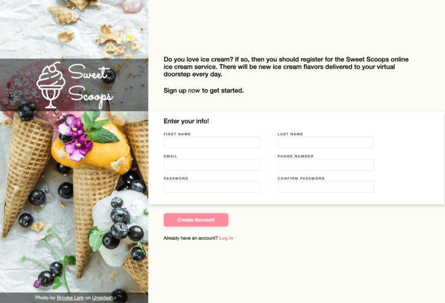

# Sweet Scoops Sign-Up Form

## Introduction

This project is a sample sign-up form webpage, built from CSS and HTML.

The project primarily demonstrates various HTML and CSS tools and skills including form elements, form validation, default styles, positioning, text styles, SVG styling, pseudo-classes, pseudo-elements, and CSS variables/functions.

## Preview

Run this project [here](https://xsherryhe.github.io/sign-up-form/).

## Image Credits

1. Brooke Lark: https://unsplash.com/photos/8beTH4VkhLI

2. SVG Repo: https://www.svgrepo.com/svg/48972/ice-cream
